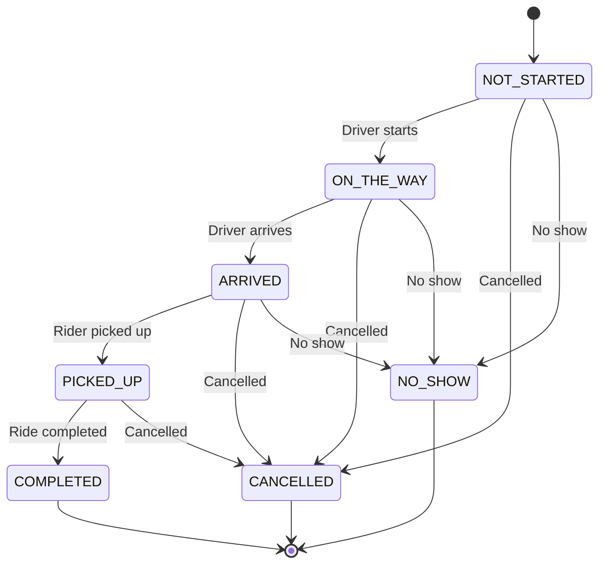

# Rides Lifecycle

## Overview

The Carriage application manages a comprehensive ride lifecycle from creation to completion, supporting both single rides and recurring ride series. The system handles status transitions, driver assignments, notifications, and various user interactions throughout the ride process.

## Ride States and Status

### Ride Types

The system supports three main ride types:

```typescript
export enum Type {
  ACTIVE = 'active',        // Currently active rides
  PAST = 'past',           // Completed or historical rides
  UNSCHEDULED = 'unscheduled' // Rides without assigned drivers
}
```

### Scheduling States

Rides have a separate scheduling state from their operational status:

```typescript
export enum SchedulingState {
  SCHEDULED = 'scheduled',     // Driver assigned
  UNSCHEDULED = 'unscheduled'  // No driver assigned
}
```

### Operational Status

The core ride status represents the current state of the ride:

```typescript
export enum Status {
  NOT_STARTED = 'not_started',  // Initial state
  ON_THE_WAY = 'on_the_way',    // Driver en route to pickup
  ARRIVED = 'arrived',          // Driver arrived at pickup location
  PICKED_UP = 'picked_up',      // Rider picked up
  COMPLETED = 'completed',      // Ride completed successfully
  NO_SHOW = 'no_show',         // Rider didn't show up
  CANCELLED = 'cancelled'       // Ride cancelled
}
```

## Status Transition Flow

### Valid Status Transitions

The system enforces specific status transitions to maintain data integrity:

```typescript
const getNextStatuses = (currentStatus: Status): Status[] => {
  switch (currentStatus) {
    case Status.NOT_STARTED:
      return [Status.ON_THE_WAY, Status.CANCELLED, Status.NO_SHOW];
    case Status.ON_THE_WAY:
      return [Status.ARRIVED, Status.CANCELLED, Status.NO_SHOW];
    case Status.ARRIVED:
      return [Status.PICKED_UP, Status.CANCELLED, Status.NO_SHOW];
    case Status.PICKED_UP:
      return [Status.COMPLETED, Status.CANCELLED];
    default:
      return []; // Terminal states
  }
};
```

### Status Transition Diagram



## Ride Creation Flow

### Single Ride Creation

**Frontend Flow**:
1. **User Action**: Rider clicks "Request a ride" button
2. **Modal Selection**: System opens `RequestRideModal`
3. **Form Completion**: User fills out ride details in `CreateOrEditRideModal`
4. **Validation**: Client-side validation of ride data
5. **API Call**: POST request to `/api/rides`
6. **Confirmation**: Success toast notification

**Backend Processing**:
1. **Validation**: Server validates ride data and user permissions
2. **Ride Creation**: New ride record created with `NOT_STARTED` status
3. **Scheduling State**: Set to `UNSCHEDULED` (no driver assigned)
4. **Notification**: System sends creation notification
5. **Response**: Returns created ride data to frontend

### Recurring Ride Creation

**Frontend Flow**:
1. **User Action**: Rider selects recurring ride option
2. **Recurrence Configuration**: User sets recurrence pattern (daily, weekly, custom)
3. **Date Range**: User specifies start and end dates
4. **Form Submission**: Recurring ride data submitted

**Backend Processing**:
1. **Parent Ride Creation**: Master ride record created with recurrence data
2. **Recurrence Fields**: System populates RFC 5545 recurrence fields
3. **Scheduled Generation**: Daily job creates individual ride instances
4. **Notification**: Creation notification sent

**Recurrence Fields**:
```typescript
export type RideType = {
  // ... other fields
  isRecurring: boolean;
  rrule?: string;        // RFC 5545 recurrence rule
  exdate?: string[];     // Excluded dates
  rdate?: string[];      // Additional dates
  parentRideId?: string; // Reference to parent ride
  recurrenceId?: string; // Original start time for overrides
  timezone?: string;     // Timezone for calculations
};
```

## Driver Assignment Flow

### Automatic Assignment

**Process**:
1. **Availability Check**: System checks driver availability for ride time
2. **Matching Algorithm**: Finds suitable driver based on:
   - Availability schedule
   - Current workload
   - Location proximity
   - Vehicle capacity
3. **Assignment**: Driver assigned to ride
4. **Status Update**: `schedulingState` changed to `SCHEDULED`
5. **Notification**: Driver and rider notified of assignment

### Manual Assignment

**Admin Process**:
1. **Admin Action**: Admin manually assigns driver via admin interface
2. **Driver Selection**: Admin selects from available drivers
3. **Assignment**: Driver assigned to ride
4. **Status Update**: `schedulingState` changed to `SCHEDULED`
5. **Notification**: All parties notified

### Assignment API

```typescript
// Update ride with driver assignment
PUT /api/rides/:id
{
  "driver": "driver-id",
  "schedulingState": "scheduled"
}
```

## Status Update Flow

### Driver Status Updates

**Driver Actions**:
1. **Status Selection**: Driver selects next valid status
2. **API Call**: PUT request to `/api/rides/:id`
3. **Validation**: Server validates status transition
4. **Update**: Ride status updated in database
5. **Notification**: Rider and admin notified of status change

**Status Update API**:
```typescript
PUT /api/rides/:id
{
  "status": "on_the_way" | "arrived" | "picked_up" | "completed"
}
```

### Admin Status Updates

**Admin Actions**:
1. **Admin Interface**: Admin accesses ride details
2. **Status Selection**: Admin selects new status
3. **API Call**: PUT request to `/api/rides/:id`
4. **Update**: Ride status updated
5. **Notification**: All parties notified

## Ride Cancellation Flow

### Rider Cancellation

**Frontend Flow**:
1. **Cancel Action**: Rider clicks cancel button
2. **Confirmation Modal**: System shows cancellation confirmation
3. **Ride Summary**: Displays ride details for confirmation
4. **API Call**: DELETE request to `/api/rides/:id`
5. **Confirmation**: Success notification shown

**Backend Processing**:
1. **Validation**: Check if cancellation is allowed
2. **Status Update**: Set status to `CANCELLED`
3. **Driver Notification**: Notify driver of cancellation
4. **Admin Notification**: Notify admin of cancellation
5. **Cleanup**: Remove from driver's schedule

### Driver Cancellation

**Process**:
1. **Driver Action**: Driver cancels ride
2. **API Call**: PUT request with `CANCELLED` status
3. **Validation**: Check cancellation permissions
4. **Notification**: Rider and admin notified
5. **Rescheduling**: System may attempt to find replacement driver

### Admin Cancellation

**Process**:
1. **Admin Action**: Admin cancels ride
2. **API Call**: DELETE or status update
3. **Notification**: All parties notified
4. **Documentation**: Cancellation reason recorded

## Recurring Ride Management

### Daily Ride Generation

**Scheduled Process**:
1. **Daily Job**: Runs at 10:05 AM daily
2. **Query**: Find recurring rides for next day
3. **Generation**: Create individual ride instances
4. **Assignment**: Assign drivers if available
5. **Notification**: Notify riders of generated rides

**Generation Logic**:
```typescript
function createRepeatingRides() {
  const tomorrowDate = moment().add(1, 'days');
  const tomorrowDateOnly = tomorrowDate.format('YYYY-MM-DD');
  const tomorrowDay = tomorrowDate.weekday();

  const condition = new Condition()
    .where('recurring').eq(true)
    .where('recurringDays').contains(tomorrowDay)
    .where('startTime').le(tomorrowDate.toISOString())
    .where('endDate').ge(tomorrowDateOnly)
    .where('deleted').not().contains(tomorrowDateOnly);

  Ride.scan(condition).exec((_, data) => {
    data?.forEach((masterRide) => {
      // Create individual ride instance
      const ride = new Ride({
        id: uuid(),
        startTime: newStartTime,
        endTime: newEndTime,
        rider: masterRide.rider,
        startLocation: masterRide.startLocation,
        endLocation: masterRide.endLocation,
      });
      ride.save();
    });
  });
}
```

### Recurring Ride Editing

**Edit Types**:
1. **Single Instance**: Edit only one occurrence
2. **All Future**: Edit all future occurrences
3. **All Instances**: Edit entire series

**Frontend Flow**:
1. **Edit Action**: User clicks edit on recurring ride
2. **Type Selection**: System shows edit type modal
3. **Form Completion**: User modifies ride details
4. **API Call**: PUT request with appropriate scope
5. **Confirmation**: Success notification

## Notification System

### Notification Events

**Ride-Related Notifications**:
- **Ride Created**: New ride request
- **Driver Assigned**: Driver assigned to ride
- **Status Updates**: Each status change
- **Ride Cancelled**: Cancellation notifications
- **No Show**: No-show notifications

### Notification Flow

**Process**:
1. **Event Trigger**: Ride status or data change
2. **Event Detection**: System identifies notification event
3. **Message Generation**: Create appropriate message
4. **Recipient Determination**: Identify notification recipients
5. **Delivery**: Send via push notification or email

**Notification API**:
```typescript
// Send notification for ride event
POST /api/notification/subscribe
{
  "userType": "rider" | "driver" | "admin",
  "userId": "user-id",
  "platform": "web" | "android" | "ios"
}
```

## Data Flow Architecture

### Frontend State Management

**Rides Context**:
```typescript
type ridesState = {
  unscheduledRides: Ride[];
  scheduledRides: Ride[];
  refreshRides: () => Promise<void>;
};
```

**State Updates**:
1. **Initial Load**: Fetch all rides on component mount
2. **Real-time Updates**: Refresh rides after status changes
3. **Filtering**: Separate scheduled and unscheduled rides
4. **Caching**: Context-based data caching

### Backend Data Processing

**Ride Model**:
```typescript
const schema = new dynamoose.Schema({
  id: { type: String, required: true, hashKey: true },
  type: { type: String, enum: Object.values(Type), required: true },
  status: { type: String, enum: Object.values(Status), required: true },
  schedulingState: { type: String, enum: Object.values(SchedulingState), required: true },
  startLocation: Location,
  endLocation: Location,
  startTime: { type: String, required: true, validate: isISO8601 },
  endTime: { type: String, required: true, validate: isISO8601 },
  rider: Rider,
  driver: Driver,
  // ... recurrence fields
});
```

## API Endpoints

### Ride Management

**Core Endpoints**:
- `GET /api/rides` - Get all rides with filtering
- `GET /api/rides/:id` - Get specific ride
- `POST /api/rides` - Create new ride
- `PUT /api/rides/:id` - Update ride
- `DELETE /api/rides/:id` - Delete ride

**Specialized Endpoints**:
- `GET /api/rides/rider/:id` - Get rides by rider
- `GET /api/rides/repeating` - Get repeating rides
- `GET /api/rides/download` - Download rides as CSV

### Query Parameters

**Filtering Options**:
- `type`: Filter by ride type (active, past, unscheduled)
- `status`: Filter by ride status
- `rider`: Filter by rider ID
- `driver`: Filter by driver ID
- `date`: Filter by date range
- `schedulingState`: Filter by scheduling state

## Error Handling

### Validation Errors

**Common Validation Issues**:
- Invalid date/time formats
- Missing required fields
- Invalid status transitions
- Permission violations
- Driver availability conflicts

**Error Response Format**:
```json
{
  "error": "Invalid status transition",
  "code": "INVALID_TRANSITION",
  "details": "Cannot transition from COMPLETED to ON_THE_WAY"
}
```

### Business Logic Errors

**Error Types**:
- **Driver Unavailable**: No drivers available for requested time
- **Invalid Time**: Ride time outside operating hours
- **Permission Denied**: User lacks permission for action
- **Ride Not Found**: Ride ID doesn't exist
- **Status Conflict**: Invalid status transition

## Performance Considerations

### Database Optimization

**Indexing Strategy**:
- Primary key on ride ID
- Global secondary indexes on rider, driver, status
- Composite indexes for common queries
- Time-based indexes for date filtering

**Query Optimization**:
- Efficient filtering and pagination
- Batch operations for recurring rides
- Connection pooling for database access
- Caching for frequently accessed data

### Real-time Updates

**Update Strategies**:
- WebSocket connections for real-time status updates
- Polling for status changes
- Push notifications for important events
- Optimistic updates for better UX

## Security Considerations

### Access Control

**Permission Levels**:
- **Riders**: Can create, edit, and cancel their own rides
- **Drivers**: Can update status of assigned rides
- **Admins**: Full access to all ride operations

**Data Protection**:
- Input validation and sanitization
- SQL injection prevention
- XSS protection
- Rate limiting on API endpoints

### Audit Trail

**Tracking**:
- All status changes logged
- User actions recorded
- Timestamp and user ID for each change
- Change history maintained

## Testing Strategy

### Test Coverage

**Unit Tests**:
- Status transition validation
- Recurring ride generation
- Notification logic
- Data validation

**Integration Tests**:
- API endpoint testing
- Database operations
- Notification delivery
- End-to-end workflows

**Test Data**:
- Mock ride data for testing
- Test user accounts
- Simulated status transitions
- Notification testing

## Future Enhancements

### Planned Features

1. **Real-time Tracking**: GPS tracking of drivers
2. **Dynamic Pricing**: Time-based pricing adjustments
3. **Route Optimization**: Optimal route calculation
4. **Predictive Analytics**: Demand forecasting
5. **Mobile App**: Native mobile applications

### Technical Improvements

1. **WebSocket Integration**: Real-time updates
2. **GraphQL API**: More flexible data querying
3. **Microservices**: Service decomposition
4. **Event Sourcing**: Complete event history
5. **Machine Learning**: Intelligent driver assignment
